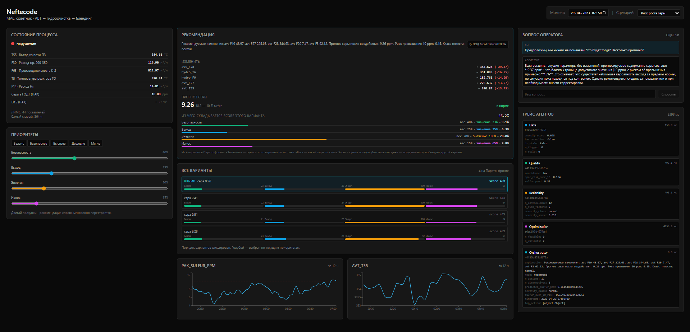
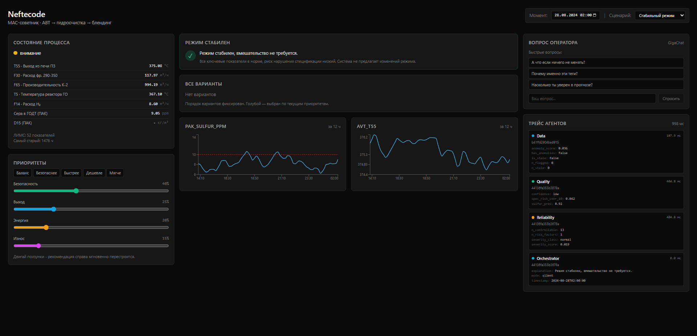
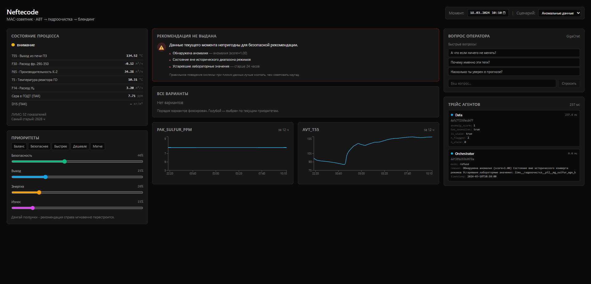

# Neftecode. МАС-советник для оператора НПЗ

Мультиагентная система, которая по цепочке **АВТ -> гидроочистка -> блендинг** прогнозирует качество товарного дизельного топлива (в первую очередь - содержание серы), оценивает риск нарушения спецификации 10 мг/кг и предлагает оператору **безопасное объяснимое управляющее воздействие**. При недостатке данных система корректно **отказывается** от рекомендации.



*Слева — состояние процесса и ползунки приоритетов оператора. Центр — карточка рекомендации: изменения тегов, прогноз серы с 90%-интервалом, разбивка score по 4 метрикам, весь Парето-фронт вариантов. Справа — вопросы оператору к GigaChat и трейс агентов.*

## Куда смотреть жюри (в порядке важности)

| Хочу увидеть | Открывать |
|---|---|
| **Живую систему** | `docker compose up` -> http://localhost:3000 |
| **ML-метрики, прогнозы, walk-forward, SHAP** | [`notebooks/ml_report.ipynb`](notebooks/ml_report.ipynb) - рендерится прямо на GitHub |
| **Архитектуру одним взглядом** | Диаграмма ниже + [`docs/tz/structure.md`](docs/tz/structure.md) |
| **Как разложены обязанности агентов** | [`docs/architecture_agents.md`](docs/architecture_agents.md) |
| **Контракт ML-модуля** | [`docs/api_ml.md`](docs/api_ml.md) |
| **Как правильно читать сырые данные** | [`docs/tz/data_reference.md`](docs/tz/data_reference.md) |

## Что показывает демо

Три сценария готовы прямо на дашборде (селектор «Сценарий» в правом верхнем углу):

| Сценарий | Момент истории | Ожидаемое поведение системы |
|---|---|---|
| **Стабильный режим** | 2024-08-28 02:00 | `silent` - «вмешательство не требуется», зелёная плашка |
| **Риск роста серы** | 2023-04-29 07:50 | `recommend` - 4 варианта Парето-фронта, LLM-объяснение, ползунки перестраивают выбор |
| **Аномальные данные** | 2024-03-18 10:10 | `refuse` - красная плашка со списком причин (аномалия, вне envelope, старая ЛИМС) |

### Стабильный режим — система молчит



*Ключевые датчики в норме, сера 9.05 ppm. Оркестратор возвращает `mode: silent`, вмешательство не предлагается. В трейсе видны data + quality + reliability, до оптимизатора не дошло.*

### Аномальные данные — система отказывается



*Anomaly-score 1.0, состояние вне исторического envelope, ЛИМС старше 24 часов. Система явно перечисляет причины и **не** выдаёт рекомендацию наугад. Это соответствует требованию ТЗ: «умение корректно отказаться — часть качественного решения».*

## Метрики моделей на test (2025-07-01 → 2026-08-07)

Обучение на 2023-01-01…2024-12-31, walk-forward без утечки, интервалы калибруются на predecessor'ах точки. Из [`backend/ml/artifacts/metrics_report.json`](backend/ml/artifacts/metrics_report.json).

| Модель | Таргет | n | MAE | Coverage 90% | Baseline MAE | ML лучше? |
|---|---|---|---|---|---|---|
| **QualityHydro** | **sulfur_ppm** ⭐ | 57 889 | **0.74 ppm** | 90.6% | 1.56 ppm | ✅ в 2.1× |
| QualityHydro | T50 | 349 | 3.42 °C | 97.1% | 5.57 °C | ✅ |
| QualityHydro | T95 | 388 | 5.51 °C | 94.8% | 5.55 °C | ✅ |
| QualityHydro | D15 | 173 | 1.89 kg/m³ | 73.4% | 2.09 kg/m³ | ✅ |
| QualityAVT | T50 | 244 | 6.92 °C | 95.1% | 40.11 °C | ✅ в 5.8× |
| QualityAVT | T90 | 167 | 6.61 °C | 99.4% | 7.08 °C | ✅ |
| QualityAVT | D15 | 73 | 5.26 kg/m³ | 90.4% | 34.52 kg/m³ | ✅ в 6.6× |

**Recall превышений серы 10 мг/кг = 90.2%** (на 5 684 фактических превышениях в test). То есть система ловит 9 из 10 реальных нарушений спецификации.

**Скорость инференса** одной точки: median 156 ms (AVT), 147 ms (hydro). Оптимизатор возвращает 8-12 вариантов Парето за 3-4 секунды.

**Технологическая честность:** для целей, где ML не обогнал baseline на validation (например, T90 hydro), residual-модель **отключается**, используется чистая формула ВАК. Это видно в поле `selected_predictor` и `disabled_ml_targets` отчёта.

## Одна команда для запуска

```bash
cp .env.example .env
# заполнить GIGACHAT_CREDENTIALS (без него Q&A уйдёт в fallback, остальное работает)
make up
```

- Дашборд: **http://localhost:3000**
- OpenAPI Swagger: http://localhost:8000/docs
- Ноутбук: `docker compose exec backend jupyter lab --ip 0.0.0.0 --port 8888 --allow-root --no-browser`

Требуется: Docker Desktop с ≥ 6 ГБ памяти WSL2 (`%USERPROFILE%\.wslconfig` -> `memory=8GB`). Данные хакатона положить в папку `hackathon/` в корне.

Обучение моделей - один раз локально:
```bash
cd backend
python -m ml.training.train_all
```
Артефакты (`.pkl`, `metrics_report.json`) появятся в `backend/ml/artifacts/`. Docker их подхватит автоматически при следующем `make up`.

## Архитектура

```
┌─────────────────────────────────────────────────────────────┐
│  FRONTEND (Next.js 14 + TypeScript + Recharts)              │
│  StatePanel · RecommendationCard · Парето-варианты          │
│  Ползунки приоритетов · QAChat к GigaChat · Трейс агентов   │
└──────────────────────────┬──────────────────────────────────┘
                           │ REST JSON
┌──────────────────────────┴──────────────────────────────────┐
│  BACKEND (FastAPI + Python 3.11)                            │
│                                                             │
│  ┌──────────────────────────────────────────────────────┐   │
│  │  ORCHESTRATOR                                        │   │
│  │  data -> (quality ‖ reliability) -> optimization       │   │
│  │  -> ranking -> LLM formatter -> response                │   │
│  └──────────────┬────────────────────────────┬──────────┘   │
│                 │                            │              │
│  ┌──────────────▼──────────┐   ┌─────────────▼──────────┐   │
│  │  ML CORE                │   │  LLM LAYER             │   │
│  │  • QualityAVT (LightGBM │   │  • GigaChat client     │   │
│  │    поверх ВАК-формул,   │   │    (кеш + TTL, rate    │   │
│  │    квантильная регресс.)│   │    limit)              │   │
│  │  • QualityHydro (сера,  │   │  • MCP read-only tools │   │
│  │    T50, T90, D15)       │   │  • Formatter + Q&A     │   │
│  │  • BlendingModel        │   │  • Guardrails: числа   │   │
│  │    (физика, не ML)      │   │    только из JSON      │   │
│  │  • AnomalyDetector      │   │                        │   │
│  │  • ParetoOptimizer      │   │                        │   │
│  │    (Optuna, 4 цели)     │   │                        │   │
│  └─────────────┬───────────┘   └────────────────────────┘   │
│                │                                            │
│  ┌─────────────▼───────────────────────────────────────┐    │
│  │  DATA LAYER                                         │    │
│  │  loaders (csv/xlsx -> parquet) · time-join           │    │
│  │  (asof-backward, никакой утечки будущего)           │    │
│  │  simulator.get_state(ts) · feature_registry.yaml    │    │
│  └─────────────┬───────────────────────────────────────┘    │
└────────────────┼────────────────────────────────────────────┘
                 │
        ┌────────▼────────┐
        │ data/*.parquet  │  <- кеш из hackathon/
        │ ml/*.pkl        │  <- обученные модели
        │ tracing.db      │  <- SQLite логи обмена агентов
        └─────────────────┘
```

## Как принимаются решения - по шагам

1. **Data agent** проверяет свежесть ЛИМС и аномалии (Isolation Forest + rolling z-score + envelope). Если данные протухли - `refuse`.
2. **Quality agent** запускает `QualityAVTModel` и `QualityHydroModel` параллельно - прогноз серы, T50/T90/D15 с 90%-интервалом (квантильная регрессия + conformal-калибровка).
3. **Reliability agent** оценивает тяжесть режима и возвращает **безопасный диапазон каждой управляемой ручки** (теги за envelope исключаются, чтобы оптимизатор не советовал невозможное).
4. **Optimization agent** через **Optuna** гоняет NSGA-подобный поиск по 4 целям: сера↓, выход↑, энергия↓, износ↓. Возвращает Парето-фронт (обычно 8–12 вариантов).
5. **Orchestrator** ранжирует, выбирает best + 3 альтернативы, дёргает **Formatter (GigaChat)** для человеческого текста.
6. **Guardrail**: любое число в тексте от LLM обязано присутствовать в исходном JSON. Иначе - fallback на шаблон.
7. Всё пишется в **SQLite-трейсер**, доступно на дашборде и через `GET /trace/{decision_id}`.

## Ключевые фишки (то, чем гордимся)

**Честная защита от утечки будущего.**
`merge_asof(direction="backward")` для ПАК и ЛИМС, walk-forward валидация без random shuffle, `label__`-префикс для тренировочных лейблов и явная задержка ЛИМС 4 часа для инференса. Никакие «магические» цифры из будущего в модели не попадают.

**VAK-формулы как физический прайер.**
Модели качества обучены не «с нуля», а как остатки над справочными формулами виртуальных анализаторов из `формулы_ВАК.xlsx`. Единицы и физсмысл тегов сверены с `expert_reference.json` (598 позиций из официального справочника хакатона).

**Envelope-фильтр через k-NN.**
Оптимизатор не советует режимы за пределами «облака» исторически наблюдённых комбинаций тегов - вместо простых квантилей используется k-NN-расстояние в нормализованном пространстве.

**Uncertainty-интервалы.**
Квантильная регрессия LightGBM (q=0.1, q=0.5, q=0.9), затем rolling-conformal калибровка на 30 предыдущих метках. Модели показывают не точку, а интервал, coverage ≈ 90%.

**Мультиагентность с трейсом.**
5 агентов + оркестратор, обмен через pydantic-контракты, каждый шаг записан в SQLite и виден на дашборде. Это не оболочка над одной моделью, а реальные обособленные роли.

**What-if ползунки Парето (наша киллер-фича).**
Оптимизатор один раз возвращает Парето-фронт. Оператор двигает 4 ползунка приоритетов (безопасность/выход/энергия/износ) - выбор best-варианта пересортировывается **на клиенте мгновенно**, без обращения к бэку. Для обновления текста рекомендации - отдельная кнопка «↻ под мои приоритеты».

**LLM формулирует, но не решает.**
GigaChat используется только для превращения JSON в человеческий текст и для Q&A. Все критические решения (что делать с процессом) принимает детерминированный код. Guardrails не пускают выдуманные числа в ответ.

**Корректный отказ.**
Если ЛИМС протух, есть аномалия или все варианты нарушают спеку - система **явно отказывается** с указанием причин. Это часть требования ТЗ и стоит отдельного показа.

## Стек

- **Backend**: Python 3.11, FastAPI, pandas, polars, LightGBM, Optuna, scikit-learn, SHAP, pydantic v2
- **LLM**: GigaChat (через официальный SDK), MCP-сервер с read-only инструментами
- **Frontend**: Next.js 14 (App Router), TypeScript, TailwindCSS, Recharts, TanStack Query
- **Инфра**: Docker Compose, SQLite для трейсов, Parquet для кеша

## Структура репозитория

```
neftecode/
├── README.md                     <- этот файл
├── docker-compose.yml            <- весь запуск: одна команда
├── Makefile                      <- make up | logs | test | train | ingest | clean
├── .env.example                  <- шаблон конфигурации
│
├── notebooks/
│   └── ml_report.ipynb           <- ★ метрики моделей, графики, SHAP, walk-forward
│
├── docs/
│   ├── architecture_agents.md    <- как устроен обмен между агентами
│   ├── api_ml.md                 <- публичный API ML-модуля
│   └── tz/
│       ├── tz_ml.md              <- ТЗ MLщика
│       ├── tz_ai_agent.md        <- ТЗ AI-агентщика
│       ├── data_reference.md     <- как читать исходники (LIMS/ПАК/ВАК)
│       └── structure.md          <- полная структура проекта
│
├── backend/
│   ├── app/                      <- FastAPI (routes, config, deps, adapters)
│   ├── agents/                   <- 5 агентов + Orchestrator
│   ├── llm/                      <- GigaChat client, MCP, Formatter, Q&A, Guardrails
│   ├── data_layer/               <- loaders, time-join, simulator, feature_registry
│   ├── ml/
│   │   ├── models/               <- QualityAVT, QualityHydro, Blending, Anomaly
│   │   ├── optimizer/            <- ParetoOptimizer (Optuna)
│   │   ├── validation/           <- walk_forward.py
│   │   ├── training/             <- train_all.py + prepare_features.py
│   │   ├── vak.py                <- парсер и вычисление формул виртуальных анализаторов
│   │   ├── envelope.py           <- k-NN envelope для отсечения экстраполяций
│   │   ├── expert_reference.json <- справочник тегов из xlsx хакатона
│   │   └── demo_scenarios.py     <- CLI ML-only демо (без агентов/HTTP)
│   ├── tracing/                  <- AgentTracer + SQLite store
│   └── tests/                    <- 15+ файлов pytest
│
├── frontend/
│   ├── app/                      <- Next.js pages
│   ├── components/               <- StatePanel, RecommendationCard, ParetoChart,
│   │                                WeightSliders, QAChat, AgentTrace, TimeMachine
│   └── lib/                      <- типизированный HTTP-клиент к бэку
│
├── hackathon/                    <- gitignored, туда положить исходники хакатона
└── data/                         <- gitignored, автогенерируемый parquet-кеш
```

## Что в ноутбуке `notebooks/ml_report.ipynb`

Открывается прямо на GitHub. Внутри:

1. **Методика и защита от утечки** - как разбит train/val/test, как калибруются интервалы.
2. **Загрузка артефактов** - колоночным чанком, чтобы не тянуть 130 МБ.
3. **Таблица итоговых метрик** на test - MAE, RMSE, coverage 90%, baseline MAE (VAK-формула), precision/recall для превышений серы.
4. **Прогноз vs факт** - графики с 90%-полосой и линией спецификации.
5. **SHAP-объяснение** для реальной точки - какие теги повлияли на прогноз серы.
6. **Парето-фронт на демо-точке** - оптимизатор возвращает варианты, они визуализируются.

## Команда

3 человека:
- **MLщик** - модели качества, оптимизатор, walk-forward валидация, ноутбук.
- **AI-агентщик** - оркестратор, LLM-интеграция, MCP, guardrails, трейсер.
- **Fullstack + Team Lead** - data layer, HTTP API, весь Next.js-фронт, инфра, интеграция.

## Команды разработки

```bash
make up        # поднять backend + frontend
make down      # остановить
make logs      # смотреть логи
make ingest    # регенерировать parquet-кеш из hackathon/
make train     # обучить ML-модели (запустить внутри контейнера)
make test      # pytest
make clean     # снести всё вместе с volumes
```

## Данные хакатона

Исходники не коммитятся (gitignored `hackathon/`). Ожидаемый состав:

- `hackathon/data/avt_tags.csv` - телеметрия АВТ (74 тега, 10-мин ряды)
- `hackathon/data/242000_tags.csv` - телеметрия гидроочистки (28 тегов)
- `hackathon/Выгрузка ПАК ...xlsx` - поточные анализаторы (сера, D15)
- `hackathon/ЛИМСы ...xlsx` - лабораторные анализы
- `hackathon/Теги_хакатон.xlsx` - справочник тегов + формулы ВАК
- `hackathon/АВТ_схемы.pdf`, `hackathon/ТЗ_нефтекод.docx`

Подробный разбор форматов (включая многоуровневую разметку ЛИМС) - в [`docs/tz/data_reference.md`](docs/tz/data_reference.md).
